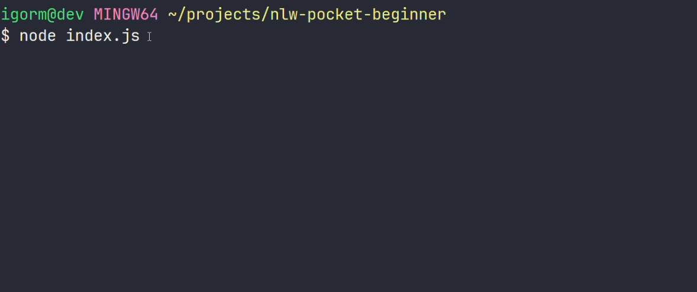

  

---

> ### **First Day**

  

    Na aula do primeiro dia aprendi que programar nada mais é do que um conjunto de passos para resolver um determinado problema. Para isso, é necessário saber como o computador funciona e como dar instruções para ele usando alguma linguagem de programação. 
      
    A linguagem usada na aula foi o JavaScript, portanto foi instalado alguns programas para ajudar no desenvolvimento do projeto Pocket, são eles: Node.js, VScode, Git.
    Com os programas instalados no computador o professor Mayk deu uma breve introdução sobre os conceitos que envolve uma linguagem de programação, nesse caso, o JavaScript. 
          
    Por meio destes conceitos o programador consegue aplicar as fases necessárias para resolver um problema, essas fases envolve, coletar os dados, processar eles, seja manipulando ou alterando os dados coletados e por fim, apresentar os dados para quem os requisitou.
  

  

    <strong>Ferramentas:</strong> Visual Studio Code, Node.js, Git Bash
  

---

> ### **Second Day**

  

    Na aula do segundo dia foi colocado em prática todos os fundamentos do JavaScript na construção do projeto Pocket, além disso foi introduzido novos conceitos de estrutura de dados e fluxo de controle, achei o projeto bem completo para quem é iniciante, pois consigo ver muito bem como cada parte do código se conecta entre as linhas de código, fantastico ou mágico, não sei como me expressar. Haha!
      
    Nessa aula o professr Mayk utilizou a biblioteca "inquerer" para criar e gerenciar a interface do projeto pelo terminal. Essa biblioteca é usada para criar interfaces (CLI) interativas, muito utilizada em ambientes de automação, scripts ou ferramentas que precisam de interação com o usuário de forma eficiente, sem a necessidade de uma (GUI).
      
    Depois da instalação e importação da biblioteca, desestruturamos a requisição buscando somente o que seria usado no projeto, então criamos a lógica que seria usada no cadastro, listagem e saida da aplicação, nessa etapa da aula utilizamos muito operações assincronas, acredito que seja uma forma de evitar o uso excessivo de .then() e .catch().
  

  

    <strong>Ferramentas:</strong> inquirer
  

---

> ### **Third Day**

  

    Nessa terceira aula criamos as últimas funcionalidades da aplicação para isso usamos alguns métodos (filter, find, map) para trabalhar com Arrays, dessa forma foi possível buscar os dados necessários para a requisição do usuário.
      
    Também usamos o módulo fs (File System) disponível no Node.js para atualizar os dados do arquivo onde eles foram salvos.
      
    Além disso, trabalhamos com algumas funções internas do JavaScript para JSON (JSON.parse(), JSON.stringify()), possibilitando converter os dados de um objeto JS para o formato JSON e JSON para JS, durante esse processo usamos muito o Spread Operator para cópia os dados que seriam salvos posteriormente no arquivo goals.json.
  

  

    <strong>Ferramentas:</strong> File System, JSON, Spread Operator
  

---

Feito com ❤ by Igor 🖖

<!-- 
  Repositório oficial:
  https://github.com/rocketseat-education/nlw-pocket-js-iniciantes
-->